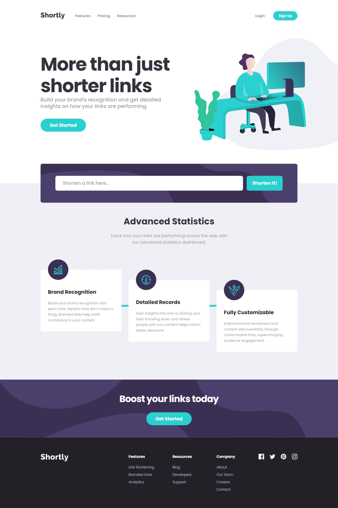
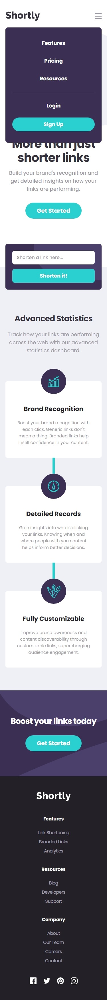
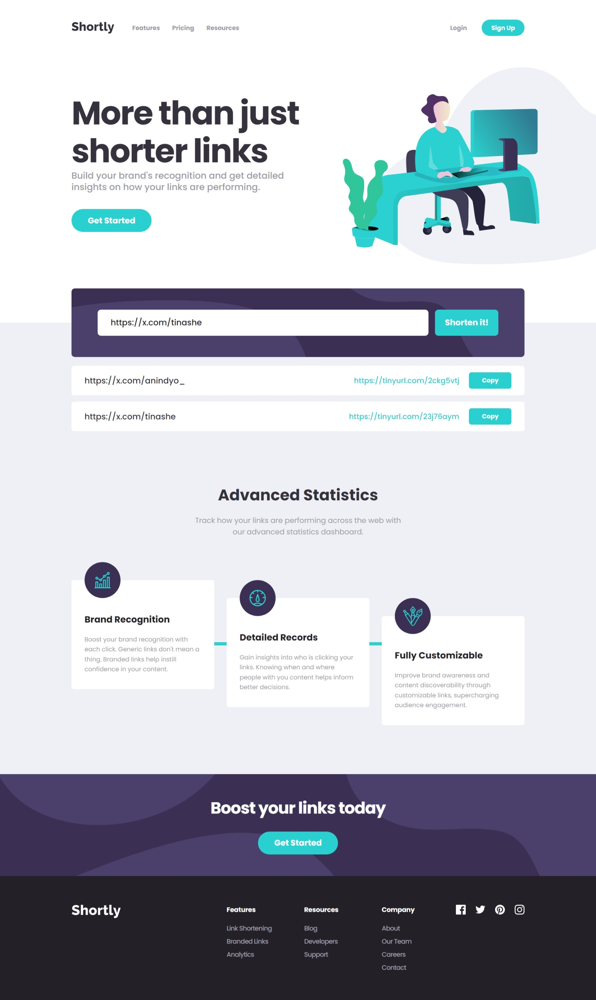

# Frontend Mentor - Shortly URL shortening API Challenge solution

This is a solution to the [Shortly URL shortening API Challenge challenge on Frontend Mentor](https://www.frontendmentor.io/challenges/url-shortening-api-landing-page-2ce3ob-G). Frontend Mentor challenges help you improve your coding skills by building realistic projects. 

## Table of contents

- [Overview](#overview)
  - [The challenge](#the-challenge)
  - [Screenshot](#screenshot)
  - [Links](#links)
- [My process](#my-process)
  - [Built with](#built-with)  
- [Author](#author)

## Overview

### The challenge

Users should be able to:

- View the optimal layout for the site depending on their device's screen size
- Shorten any valid URL
- See a list of their shortened links, even after refreshing the browser
- Copy the shortened link to their clipboard in a single click
- Receive an error message when the `form` is submitted if:
- The `input` field is empty

### Screenshot

#### 1. Home Page 

- Desktop

- Mobile 

- Mobile (with Menu)

#### 2. Home Page with Shortened Links List

- Desktop

- Mobile 

### Links

- Solution URL: [Github](https://github.com/anindyoo/fe-mentor-5-shortly)
- Live Site URL: [Github Pages](https://anindyoo.github.io/fe-mentor-5-shortly/)

## My process

### Built with

- [Tinyurl API](https://https://tinyurl.com/.com) - URL Shortening API
- Semantic HTML5 markup
- [Tailwind CSS](https://tailwindcss.com/)
- [React](https://reactjs.org/) - JS library
- [Heroicons](https://heroicons.com/) - For icons
- [ESLint](https://eslint.org/) - Linting tool

## Author

- Frontend Mentor - [@anindyoo](https://www.frontendmentor.io/profile/anindyoo)
- Twitter - [@anindyo_](https://www.twitter.com/anindyo_)
